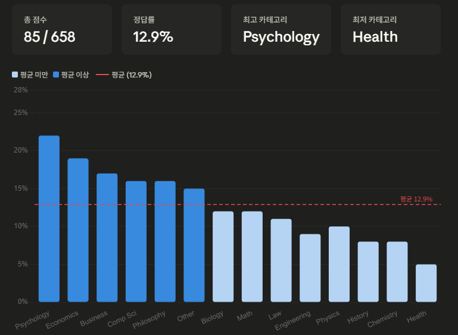

# Zeta 모델의 MMLU-ProX-Lite 벤치마크 결과

## 벤치마크 방법:

1. 벤치마크 전용 비공개 플룻 작성.
2. CoT 적용 / 할루시네이션 및 RP 금지 프롬프트 사용.
3. Tkinter로 전용 헬퍼를 작성해 체점 시스템 및 복사 붙여넣기 사용, 봇이나 매크로 일절 사용하지 않았음.

## 채점 관련:

1. 할루시네이션 발생 시 오답 처리.
2. 복수 정답이나 정답 없음, 또는 정답 번호와 정답 내용이 틀렸을 시 오답 처리.

## 벤치마크로 사용된 데이터셋:

ko 언어 사용
https://huggingface.co/datasets/li-lab/MMLU-ProX-Lite/tree/main

## 총 점수:

<b>85/658 (12.9%)</b>

## 카테고리별 점수

- Biology : 5/41 (12%)
- Business: 8/45 (17%)
- Chemistry: 5/61 (8%)
- Computer Science: 4/25 (16%)
- Economics: 9/47 (19%)
- Engineering: 5/53 (9%)
- Health: 2/40 (5%)
- History: 2/24 (8%)
- Law: 6/53 (11%)
- Math: 9/73 (12%)
- Other: 8/51 (15%)
- Philosophy: 5/30 (16%)
- Physics: 7/70 (10%)
- Psychology: 10/45 (22%)

그래프 작성: Claude

## 비교군

- Qwen 3.5 0.8B: 34.6%
- Gemma 3n E4B IT: 19.9%

## 결론

- Zeta (Spotwrite) 모델의 MMLU-ProX 점수는 4B 모델보다 낮으나, 이는 Zeta가 범용 챗봇이 아닌 캐릭터 페르소나 플랫폼이고 Zeta (Spotwrite)는 그에 맞게 최적화된 모델이기 때문입니다. 루머에 따르면 체급은 30B 정도로 추정되고 있습니다.
- 본 벤치마크는 MMLU-ProX에서 평가하는 항목에서 낮은 점수를 보였을 뿐, 스캐터랩은 Zeta (Spotwrite)의 할루시네이션 현상까지 의도적으로 유지하여, 수학적 성능보다는 롤플레잉과 감성 대화에 최적화된 모델을 지향하고 있습니다.

# FAQ

Q. 나중에 RP-Bench 등 롤플레이 관련 벤치마크도 진행할 계획이 있나요?

A. **있습니다.**

## Koji / Luca

제타에서 제공하는 기본 모델인 Zeta 외에 Koji와 Luca 모델은 별도로 벤치마크를 진행하지 않았습니다. 아래는 Koji와 Luca 모델에 대한 후보군입니다:

**Anthropic의 Claude 시리즈 (Claude 4.6 Sonnet / Opus 등)**

- 근거: 개인정보 처리 위탁 및 국외이전 수탁업체로 Anthropic이 명시되어 있습니다.
- 클로드(Claude)는 감성 대화, 캐릭터 롤플레잉, 문맥 유지 능력에서 GPT를 능가한다는 평가를 자주 받습니다.

**OpenAI의 GPT 시리즈 (GPT-5.4 Mini 등)**

- 근거: 개인정보 및 가명정보 처리 위탁 수탁업체로 OpenAI가 명시되어 있으며, 이전 국가가 '미국'으로 지정되어 있습니다.
- 현재 글로벌 커스텀 챗봇 서비스에서 가장 대중적으로 쓰이는 고성능 유료 모델입니다.

아래는 Claude 시리즈의 MMLU-Pro 벤치마크 점수입니다:

- Claude 4.5 Haiku : 76.8%
- Claude 4.5 Sonnet : 86.0%
- Claude 4.5 Opus : 89.0%

**Gemini 모델이 후보군에서 제외된 이유**

Gemini 모델 또한 롤플레잉에 사랑받는 모델이지만, 제타의 개인정보 처리방침에서 Google은 다음과 같이 한정되어 있습니다.

- 개인정보 처리 위탁: "서비스 제공 및 분석을 위한 인프라 관리, 마케팅 활동 및 맞춤형 광고(Google Analytics, Firebase 포함)"
- 가명정보 처리 위탁: "가명정보 처리를 위한 인프라 관리"

즉, 구글의 인프라나 분석 툴은 쓰고 있지만, 구글의 AI 모델을 호출해서 대화 서비스를 사용자에게 뿌리거나 AI 모델 학습 연구에 쓰고 있지는 않다는 뜻이 됩니다.
